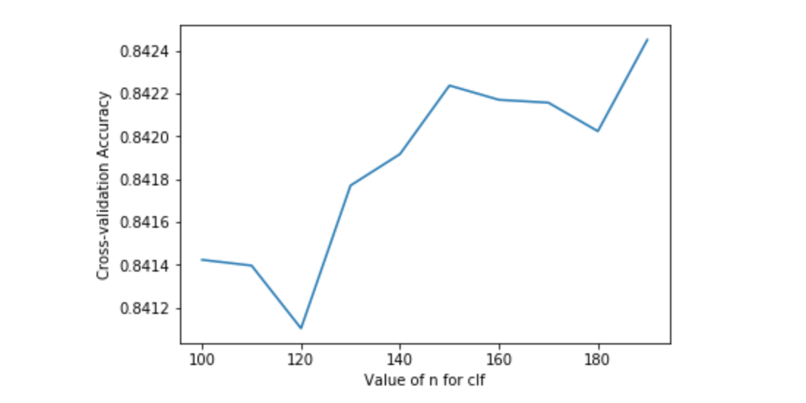

# Assignemnt House _ Qualified _ Prediction
## Content
1. Data preprocessing
2. Modelling 
3. Prediction
4. Reflection
  
## 1 Data preprocessing
### 1.1 import train dataset
`import numpy as np`  
`import pandas as pd`
`train_data = pd.read_csv('TrainingSet.csv')`

***After viewing the dataset, I found some category features like GRADE and GRADE_D were same, so I would throw these overlapping feature and some noise features with the following commend***
`train = train_data.drop(train_data.filter(regex='row ID|SSL|._D$|GIS_LAST_MOD_DTTM|SALEDATE'), axis=1)`
### 1.2 Scale
***GBA and LANDAREA Standard Deviation were too high so scale is necessary***
`from sklearn.preprocessing import StandardScaler`
`scales = StandardScaler()`
`GBA_Values = train['GBA'].values`
`GBA_re = GBA_Values.reshape(-1,1)`
`GBA_scale_param = scales.fit(GBA_re)`
`train['GBA_scales'] = scales.fit_transform(GBA_re,GBA_scale_param)`
`LANDAREA_Values = train['LANDAREA'].values`
`LANDAREA_re = LANDAREA_Values.reshape(-1,1)`
`LANDAREA_scale_param = scales.fit(LANDAREA_re)`
`train['LANDAREA_scales'] = scales.fit_transform(LANDAREA_re,LANDAREA_scale_param)`
`train = train.drop(['GBA','LANDAREA'], axis=1 )`
### 1.3 Missing values
***I also found the YR_RMDL feature has too much missing values more than 70% so I decided to drop this feature***
`train = train.drop(['YR_RMDL'], axis= 1)`  
***drop the rows don't contains at least have 10 values***
`train = train.dropna(thresh = 10)`  
***except PRICE feature, I will use the median values to fill up the missing values***  
`train[['HF_BATHRM','ROOMS','BEDRM','AYB','STORIES','FIREPLACES']]=train[['HF_BATHRM','ROOMS','BEDRM','AYB','STORIES','FIREPLACES']].fillna(train.median()) `
***I decide use Randomforest Regressor to predict the missing values of PRICE feature***
`from sklearn.ensemble import RandomForestRegressor`
`def set_missing_PRICE_values(df): `
>`PRICE_df = df[['PRICE','BATHRM','HF_BATHRM','HEAT','NUM_UNITS','ROOMS','BEDRM','AYB','EYB','STORIES','SALE_NUM','SALE_NUM','GBA_scales','BLDG_NUM','STYLE','STRUCT','GRADE','CNDTN','EXTWALL','ROOF','INTWALL','KITCHENS','FIREPLACES','USECODE','LANDAREA_scales']]`     
`PRICE_df_know = PRICE_df[PRICE_df.PRICE.notnull()].values`
`PRICE_df_unknow = PRICE_df[PRICE_df.PRICE.isnull()].values`
`y = PRICE_df_know[:,0]`
`X = PRICE_df_know[:,1:]`
`rfr = RandomForestRegressor(random_state=0, n_jobs=-1)`
`rfr.fit(X, y)`
`predictedPRICE = rfr.predict(PRICE_df_unknow[:,1:])`  
`PRICE_df.loc[(PRICE_df.PRICE.isnull()),'PRICE'] = predictedPRICE`
`return PRICE_df,rfr`  

`PRICE_df,rfr = set_missing_PRICE_values(train)`
### 1.4 Binary
`def set_binary(df):`
>`dummies_AC = pd.get_dummies(df['AC'], prefix='AC')`
    `return dummies_AC`
    
`binary_AC = set_binary(train)`	
### 1.5 The processed train dataset
`Train_final = pd.concat([PRICE_df, binary_AC, train['QUALIFIED']], axis=1)`
## 2 Modelling
***According the requirement of the assginment, i was assigned with Randomforest estimator***
### 2.1 Cross Validation
***I was goint to use Cross Validation to select beter n_estimators parameter***  
*build estimators*  
`y = Train_final['QUALIFIED'].values.reshape(-1,1)`
`X = Train_final.drop(['QUALIFIED'],axis= 1).values`
*cross validation*
`from sklearn.ensemble import RandomForestClassifier`
`from sklearn.cross_validation import cross_val_score`
`import matplotlib.pyplot as plt`
`n_range = range(100,200,10)`  
`n_scores = []`  
`y_m = Train_final['QUALIFIED']`  
`for n in n_range:`
>`clf = RandomForestClassifier(random_state=0, n_jobs=-1, n_estimators=n)`
`scores = cross_val_score(clf,X,y_m,cv=5,scoring='accuracy')`
`n_scores.append(scores.mean())`

*n_estimators and accuracy*  
`plt.plot(n_range, n_scores)`
`plt.xlabel('Value of n for clf')`
`plt.ylabel('Cross-validation Accuracy')`

***According to the picture, I will assign 150 to n_estimator*** 
### 2.2 Building model
`clf = RandomForestClassifier(random_state=0, n_jobs=-1, n_estimators=150)`
`clf.fit(X,y)`
## 3 Prediction
### 3.1 Import test dataset	
`test_data = pd.read_csv('TestingSet.csv')`
### 3.2 Data preprocessing
***the test dataset also need preprocessing and the method is similar to train dataset***  

***Drop noisy features***
`test = test_data.drop(train_data.filter(regex='SSL|._D$|GIS_LAST_MOD_DTTM|SALEDATE'), axis=1)`
`test = test.drop(['YR_RMDL'], axis= 1)`  
***Scaling***  
`GBA_Values = test['GBA'].values`
`GBA_re = GBA_Values.reshape(-1,1)`
`GBA_scale_param = scales.fit(GBA_re)`
`test['GBA_scales'] = scales.fit_transform(GBA_re,GBA_scale_param)`
`LANDAREA_Values = test['LANDAREA'].values`
`LANDAREA_re = LANDAREA_Values.reshape(-1,1)`
`LANDAREA_scale_param = scales.fit(LANDAREA_re)`
`test['LANDAREA_scales'] = scales.fit_transform(LANDAREA_re,LANDAREA_scale_param)`
`test = test.drop(['GBA','LANDAREA'], axis=1 )`  
***Missing values***
`test[['BATHRM','HF_BATHRM','HEAT','NUM_UNITS','ROOMS','BEDRM','AYB','STORIES','STYLE','STRUCT','GRADE','CNDTN','EXTWALL','ROOF','INTWALL','KITCHENS','FIREPLACES']] = test[['ROOF','INTWALL','BATHRM','HF_BATHRM','HEAT','NUM_UNITS','ROOMS','BEDRM','AYB','STORIES','STYLE','STRUCT','GRADE','CNDTN','EXTWALL','KITCHENS','FIREPLACES']].fillna(test.median())`
`PRICE_df_test, rfr2 = set_missing_PRICE_values(test)`  
***Binary***  
`binary_AC_test = set_binary(test)`
### 3.3 The processed test dataset
`test_final = pd.concat([PRICE_df_test,binary_AC_test], axis = 1)`
### 3.4 Predict
`Prediction_QUALIFIED = clf.predict(test_final)`
`result = pd.DataFrame({'row ID':test['row ID'], 'QUALIFIED': Prediction_QUALIFIED})`
`result.to_csv('TestingSet_Random.csv', index=False)`

***I had submited the result to Kaggle and got 74% accuracy***

## Reflection
In this project, there are many aspects need to be improve. For example, only Randomforest model was used in this project, however, many other model should be tried like Linear model or Tensorflow model. Another aspect is the feature selection process, many methods should be used to refine the feature selection performance. This is my first Data analysis assginment, many areas need to be corrected to improve the accuracy of the result. Any suggestions were recommended.
